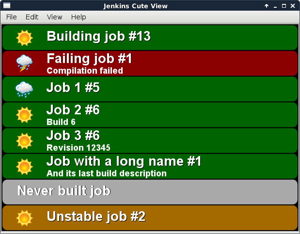
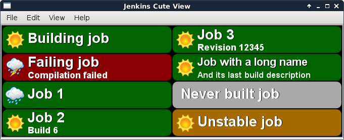

# Jenkins Cute View

Written with Qt framework, **jenkins-cute-view** can be used to display the status of your Jenkins jobs on a TV or on any display of your choice.

**Dependencies**:
- GCC (4.8+, with C++11)
- CMake (2.8+)
- Qt5 (Core, Gui, Widgets, Network)
 
**Compile > Install > Exec**:
- Clone the repository (master) and move inside
- mkdir build && cd build
- cmake ../
- make
- [sudo] make install # defaults to /usr/local/bin/jenkins-cute-view
- /usr/local/bin/jenkins-cute-view

**Hotkeys**:
- **Ctrl + Q** to quit
- **F11** to switch to fullscreen mode

Tested successfully on Debian 8, Ubuntu 15.04, Windows 7+ and Mac OSX.
Compiles (slowly) successfully but not tested on a Raspberry Pi.

### Screenshots

Classic, 1 column display with build numbers:

2 columns display for larger screens:

